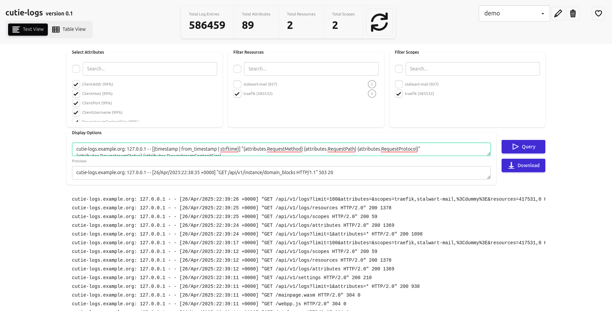
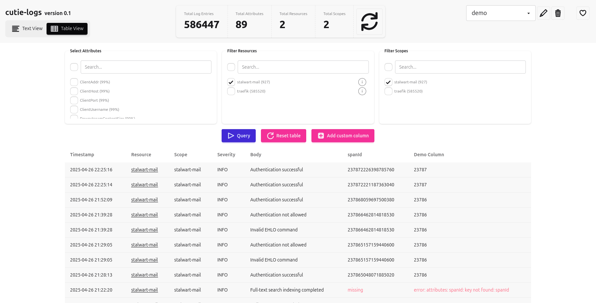

# cutie-logs [](https://woodpecker.jcm.re/repos/29)

`cutie-logs` is a very simple and minimal server for receiving OpenTelemetry logs,
storing them in a PostgreSQL database and providing a simple web interface for querying
and analysing them.




The goal of this project is to be very lightweight and it is meant mostly for small
deployments (e.g. my K8s cluster made out of SBCs), for which will OpenTelemetry stacks
would be excessive.

The project is written mostly in modern C++ (even the web UI thanks so WebAssembly!) and
compiles into a single executable only requiring a few system dependencies which are
available as Ubuntu packages.

## Warnings

The project is currently in heavy development and does **not have a stable release** yet.
It is therefore not suited for production yet and features might rapidly change.

The frontend and API also do not employ any kind of authentication and therefore
**must be run behind a proxy handling authentication**.

## Running

### Docker

The easiest way to run the application is using the automatically built Docker image:
```bash
docker run -p 4318:4318 -p 8080:8080 -e CUTIE_LOGS_DATABASE_URL=postgres://... ghcr.io/jncrmx/cutie-logs:latest
```

## Command Line Options
```
Usage: cutie-logs [--help] [--version] [--otel-address ADDRESS] [--web-address ADDRESS] [--web-dev-path PATH] [--disable-web] --database-url CONNECTION_STRING

Optional arguments:
  -h, --help                                    shows help message and exits
  -v, --version                                 prints version information and exits
  --otel-address ADDRESS                        Address to listen for OpenTelemetry requests on (env: CUTIE_LOGS_OTEL_ADDRESS) [default: "0.0.0.0:4318"]
  --web-address ADDRESS                         Address to serve web interface on (env: CUTIE_LOGS_WEB_ADDRESS) [default: "127.0.0.1:8080"]
  --web-dev-path PATH                           Path to serve static files from in development mode (env: CUTIE_LOGS_WEB_DEV_PATH)
  --disable-web                                 Disable the web interface (env: CUTIE_LOGS_DISABLE_WEB)
  --database, --database-url CONNECTION_STRING  Database connection string (env: CUTIE_LOGS_DATABASE_URL) [required]
```
